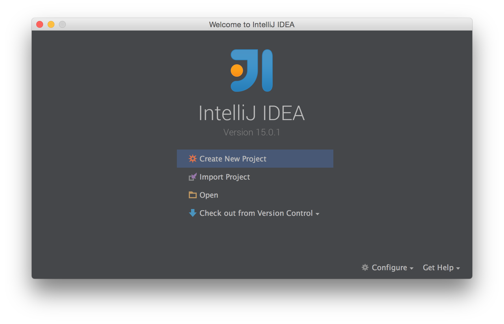
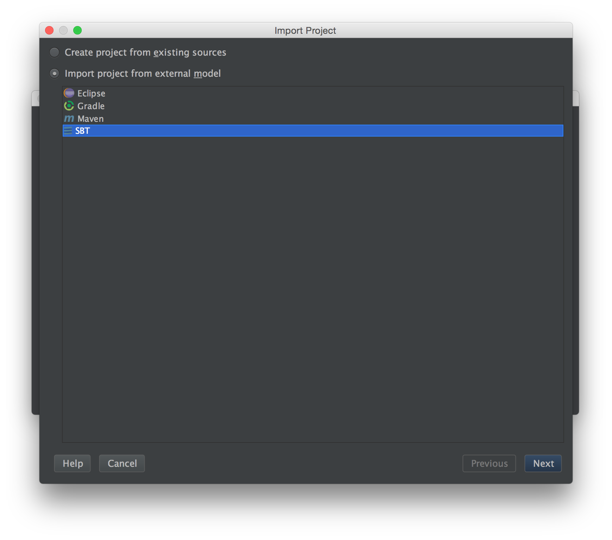
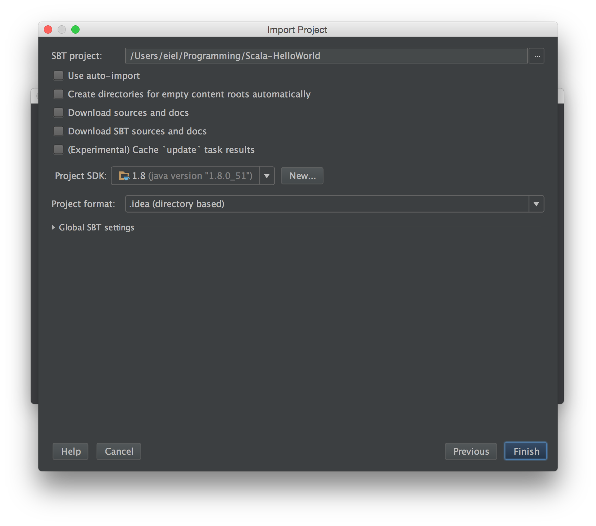
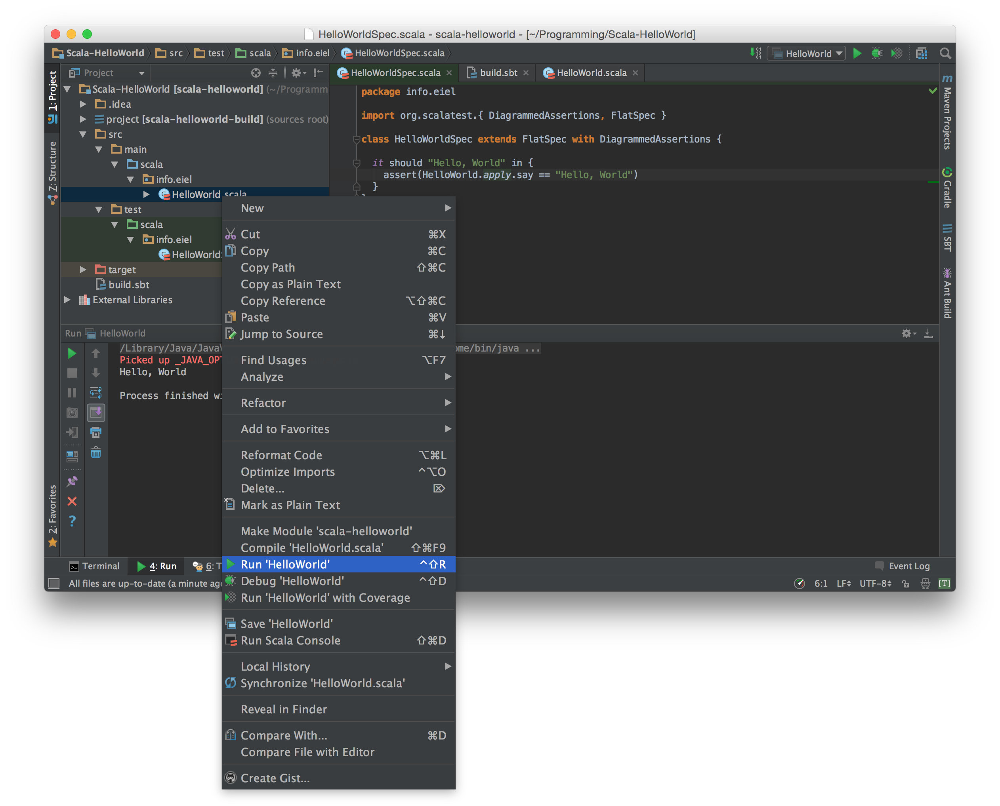

# これは何

IntelliJ IDEAのScalaプロジェクトの動作確認をするための最小のScalaプロジェクトのつもりです。

# 動作確認環境

* Scala 2.11.7
* sbt 0.13.9
* IntelliJ IDEA 15 CE

# 事前設定

* Java をインストール
* Scala をインストール
* sbt をインストール
* IntelliJ IDEAをインストール
  * Scalaプラグインをインストール

# 作業手順

```
$ git clone git@github.com:eiel/Scala-HelloWorld.git
```

IntelliJを起動



importプロジェクトを選択して、クローンしたディレクトリヲ指定




SBTを選択(Scalaプラグインをインストールしないと表示されない)



ProjectSDKが設定されてなければNEWを押す。Javaがインストールされていればいい感じのところでひらけるので、OKを押す。



適当にすすめて、HellWorldまたはHelloWorldSpecをrunする。

動けば環境構築ができています。
